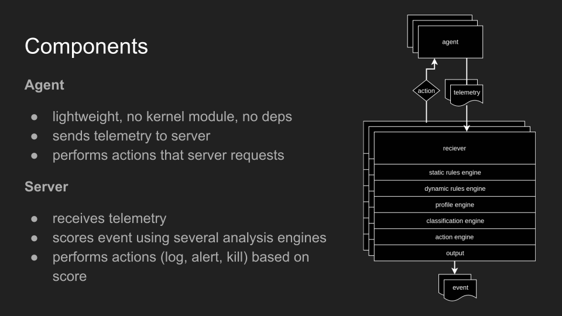

# threatseer 

Threatseer is a lightweight agent-based security telemetry solution for Linux that can be deployed to datacenters, clouds, orchestrators, and workstations.

### Try running threatseer [with Docker](docs/RUN_IT.md)

 [](https://travis-ci.org/dustin-decker/threatseer)

## Features

### Agent features

The agent collects security telemetry which is offloaded to a server for behavioral analysis.

- event-driven structured data of important system events
  - container lifecycle
  - processes touching sensitive data
  - processes spawned and lifecycle events
  - network events
- low resource cost: typically less than ~1% of one CPU core, ~30MiB RAM
- ~5mb statically compiled binary deployable

### Server features

The server component uses several behavioral analysis engines for scoring events and has several JSON telemetry output methods available:

#### Behavioral Analysis Engines

- Profile - automatic execution behavior profile generated for container image or process lifecycle
- Static - risky processes, file/directory integrity monitoring (todo), known IOCs (todo)
- Dynamic - custom queries

#### Telemetry outputs

- Elasticsearch
- Kafka
- Logstash
- Redis
- File
- Stdout

<p align="center">
  
</p>

## Example telemetry

### container RCE event

successful blind remote code execution (RCE) callback

```json
{
   "@timestamp":"2018-05-26T15:06:14.397Z",
   "src_ip":"127.0.0.1",
   "event":{
      "id":"714966143a853b3bf55ccb2683a3b6bcfcbf731f9318705485609d8ef7711b13",
      "process_pid":3789,
      "sensor_id":"49c921bc827b2aa9b5f20b0e65af9c3126c79221bac4f2b2a7edd7db7e3774aa",
      "sensor_sequence_number":27623,
      "sensor_monotime_nanos":5140132889275,
      "Event":{
         "Process":{
            "type":2,
            "exec_filename":"/usr/bin/dig",
            "exec_command_line":[
               "dig",
               "+short",
               "ifjeow0234f90iwefo2odj.wat.lol"
            ]
         }
      }
   },
   "indicators":[
      {
         "Engine":"static",
         "RuleName":"",
         "IndicatorType":"risky_process",
         "Description":"dig is a risky process often used for exfil / callback",
         "ExtraInfo":"",
         "Score":70
      },
      {
         "Engine":"dynamic",
         "RuleName":"insider_threat",
         "IndicatorType":"custom",
         "Description":"it's coming from inside the house!",
         "ExtraInfo":"origin was 127.0.0.1",
         "Score":60
      },
      {
         "Engine":"profile",
         "RuleName":"",
         "IndicatorType":"abnormal_behavior",
         "Description":"subject is behaving outside of its profile",
         "ExtraInfo":"",
         "Score":50
      }
   ]
}
```

## Architecture

<p align="center">
  
</p>

See [docs/ARCHITECTURE.md](docs/ARCHITECTURE.md) for more info.

## Docs

Docs are sparse at the moment. Threatseer is still under heavy development.

### [docs/RUN_IT.md](docs/RUN_IT.md)
### [docs/HACKING.md](docs/HACKING.md)
### [docs/CONFIGURING.md](docs/CONFIGURING.md)

## Acknowledgements

- [Capsule8](https://capsule8.com/) for their [opensource library](https://github.com/capsule8/capsule8) that made the agent sensor implementation possible. They're the ones doing the most innovation and work, and they have an [interesting product](https://capsule8.com/product/#platform) that makes use of the library.