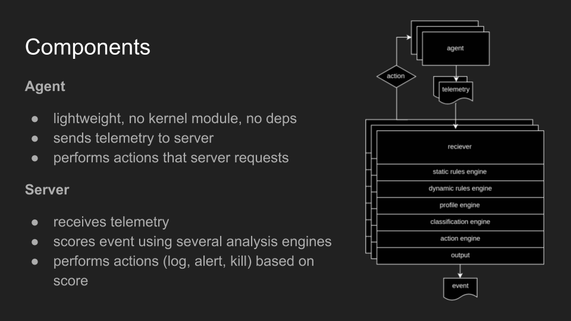
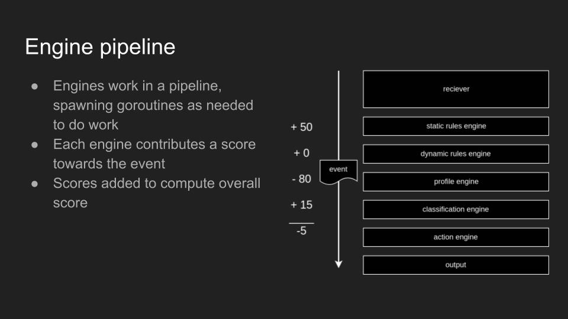

# threatseer

A lightweight linux endpoint security solution

<p align="center">
  
</p>

[](https://travis-ci.org/dustin-decker/threatseer)


## What is it?

Threatseer is an lightweight agent-based security solution for Linux, and can be deployed to datacenters, clouds, orchestrators, and workstations.

The agent collects security telemetry which is offloaded to a server for analysis.

The server component uses several analysis engines, and has raw telemetry output methods available, provided by [libbeat](https://www.elastic.co/products/beats):

- Elasticsearch
- Kafka
- Logstash
- Redis
- File
- Stdout

<p align="center">
  
</p>

## Example telemetry

### container exec

successful blind remote code execution callback

```json
{
  "Event": {
    "Process": {
      "exec_command_line": [
        "sh",
        "-c",
        "dig +short ifjeow0234f90iwefo2odj.wat.lol"
      ],
      "exec_filename": "/bin/sh",
      "type": 2
    }
  },
  "container_id": "06cba6bc8583000803f75cd4ce88a9723497e716859eb820f35bef48582e9e3f",
  "container_name": "/dazzling_darwin",
  "credentials": {},
  "id": "7d59493a8d9d4ccbee584940628c8bad5ad6a9de7b3762b3138bcab988957e95",
  "image_id": "3fd9065eaf02feaf94d68376da52541925650b81698c53c6824d92ff63f98353",
  "image_name": "alpine",
  "process_pid": 3943,
  "sensor_id": "9a608f32bc59f6d1b5ba579170fff34401ffd1840f3695f9e18a45eef7103125",
  "sensor_monotime_nanos": 1517123007197660400,
  "sensor_sequence_number": 223,
  "time": "2018-01-28T18:04:04-06:00"
}
```

## Architecture

<p align="center">
  
</p>

## Analysis engines

The server's analysis engines each contribute a risk score to an event as it flows through the pipeline. Actions can be taken depending on the overall score.

<p align="center">
  
</p>

### Static Rules Engine

The Static Rules Engine has hard-coded, high performance checks. Currently it checks for known risky processes that are often triggered during RCE attempts.

### Dynamic Rules Engine

The Dynamic Rules Engine allows for the user to prove custom query-based rules that will apply a score and an action to the events matched.

### Profile Engine (todo)

Automatically generates execution profile for binaries or container image (if applicable). Applies a positive or negative score to the event depending on if the behavior is outside, or inside the profile.

### Classification Engine (todo)

Machine learning prediction model trained on two sets of labeled data:

#### GOOD

- A baseline healthy environment

#### BAD

- ATT&CK test automation
- Red team activity
- Public exploits
- Honeypots
- Events triaged by SOC

### Action Engine

Takes action depending on final pipeline score. 
Actions are `toss`, `log`, `alert`, and `kill`. (todo)

## Docs

Docs are sparse at the moment. Threatseer is still under heavy development.

### [HACKING.md](HACKING.md)
### [CONFIGURING.md](CONFIGURING.md)


## Roadmap

- Add Profile Engine
- Implement actions (for agent and server)
- WebUI for interaction and response with events and alerts
- Add Classification Engine

## Acknowledgements

- [Capsule8](https://capsule8.com/) for their [ opensource library](https://github.com/capsule8/capsule8) that made the agent sensor implementation possible. They're the ones doing the most innovation and work, and it sounds like the have an [interesting product](https://capsule8.com/product/#platform) on the way based it.