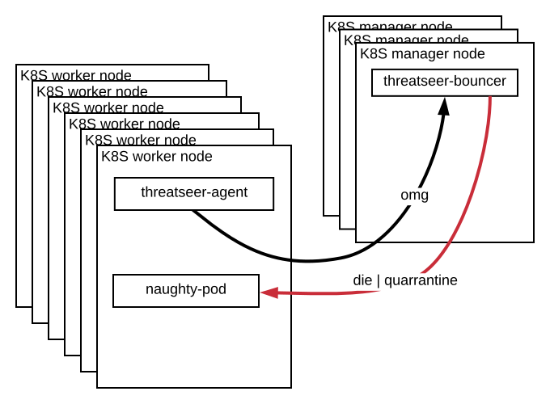
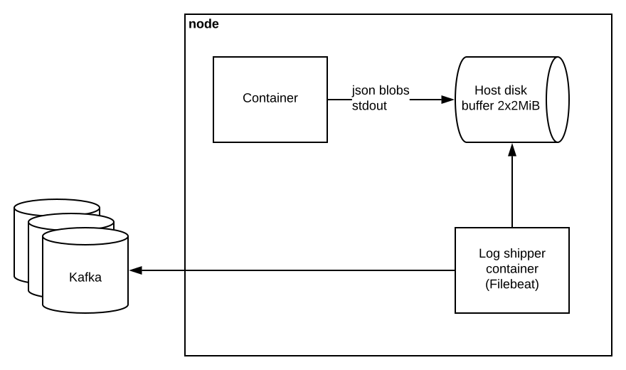
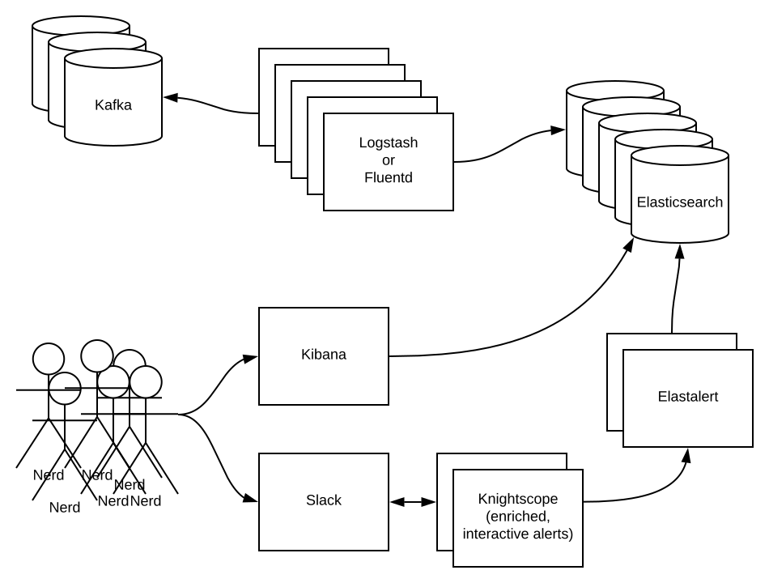

# threatseer

<p align="center">
  
</p>

[](https://travis-ci.org/dustin-decker/threatseer)

## what is it?

Threatseer provides security related telemetry from linux servers and workstations.
For many of the features, threatseer uses [Capsule8](https://github.com/capsule8/capsule8), which makes use of kernel tracing tooling to general events for the kernel activity you're interested in. Threatseer makes of other telemetry sources too, such as the Systemd D-Bus API.

It's a really young, immature project. Obviously use at your own risk, and help make it better.

## features

At a high level this project provides:

- event-driven structured data of important system events
  - container lifecycle
  - processes touching sensitive data
  - fork, exec, and other risky syscalls
  - systemd unit changes
- low resource cost: ~3% of one CPU core, ~20MiB RAM
- ~15mb statically compiled binary deployable

TODO:

- SOON: templates for actions under conditions
- SOON: a Kubernetes daemon to take action under conditions (bouncer)
- SOON: Kubernetes, Swarm, and local deployments
- SOON: Prometheus exporter integration

## build and run

### local

Fetch the deps:

``` bash
dep ensure
```

Build the binary:

``` bash
CGO_ENABLED=0 go build -o bin/agent cmd/agent/main.go
```

Run the binary (pretty printed with jq):

``` bash
sudo ./bin/agent 2>&1 | jq '.'
```

### Docker

Make the docker image:

``` bash
make build-agent
```

Run the image:

``` bash
docker run \
  --privileged \
  --name threatseer \
  --rm \
  -it \
  -v /proc:/var/run/capsule8/proc/:ro \
  -v /sys/kernel/debug:/sys/kernel/debug \
  -v /sys/fs/cgroup:/sys/fs/cgroup \
  -v /var/lib/docker:/var/lib/docker:ro \
  -v /var/run/docker:/var/run/docker:ro \
  dustindecker/threatseer
```

## getting telemetry

By default events are logged to stdout as JSON blobs. An example universal container logging pipeline described below works well with this.

Alternatively, you can use one of the dozens of [logging hooks](https://github.com/sirupsen/logrus#hooks), make your own logging hook, or use any [io.Writer](https://godoc.org/github.com/sirupsen/logrus#SetOutput).

## example telemetry

### L3 cache timing attack (could be Meltdown, Spectre, Rowhammer or others)

``` json
{
  "pid": 9071,
  "container_id": "ff426288ea903fcf8d91aca97460c613348f7a27195606b45f19ae91776ca23d",
  "container_image": "centos",
  "container_name": "/cranky_shrubbery",
  "hostname": "victimbox1",
  "l3_cache_miss_rate": 0.98009,
  "level": "warning",
  "msg": "possible Meltdown | Spectre | Rowhammer | other attack utilizing L3 cache miss timing detected",
  "time": "2018-01-30T19:37:25-06:00"
}
```

### container exec

successful blind remote code execution callback

``` json
{
  "Event": {
    "Process": {
      "exec_command_line": [
        "sh",
        "-c",
        "dig +short ifjeow0234f90iwefo2odj.wat.lol"
      ],
      "exec_filename": "/bin/sh",
      "type": 2
    }
  },
  "container_id": "06cba6bc8583000803f75cd4ce88a9723497e716859eb820f35bef48582e9e3f",
  "container_name": "/dazzling_darwin",
  "credentials": {},
  "id": "7d59493a8d9d4ccbee584940628c8bad5ad6a9de7b3762b3138bcab988957e95",
  "image_id": "3fd9065eaf02feaf94d68376da52541925650b81698c53c6824d92ff63f98353",
  "image_name": "alpine",
  "process_pid": 3943,
  "sensor_id": "9a608f32bc59f6d1b5ba579170fff34401ffd1840f3695f9e18a45eef7103125",
  "sensor_monotime_nanos": 1517123007197660400,
  "sensor_sequence_number": 223,
  "time": "2018-01-28T18:04:04-06:00"
}

```

## threatseer on Kubernetes

<p align="center">
  
</p>

## container logging

Universal solution. Just log json blobs to stdout. Ending with producing to Kafka.

<p align="center">
  
</p>

## logging pipeline, continued

Enriched, interactive investigation experience with structured data. Starting from consuming from Kafka.

<p align="center">
  
</p>

## status

Threatseer is in a rapidly changing state so you should not count on stability or the data it outputs.

## acknowledgements

- [Capsule8](https://capsule8.com/) for their [ opensource library](https://github.com/capsule8/capsule8) that made the initial implementation possible. They're the ones doing the actual innovation and work, and it sounds like the have an [interesting product](https://capsule8.com/product/#platform) on the way based it.