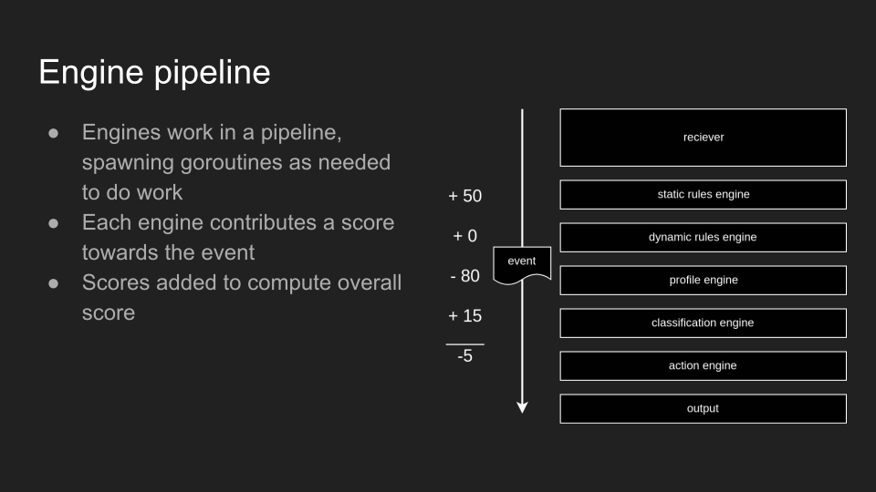

# Threatseer Architecture

  

## Analysis engines

The server's analysis engines each contribute a risk score to an event as it flows through the pipeline. Actions can be taken depending on the overall score.

  

### Static Rules Engine

The Static Rules Engine has hard-coded, high performance checks. Currently it checks for known risky processes that are often triggered during RCE attempts.

### Dynamic Rules Engine

The Dynamic Rules Engine allows for the user to prove custom query-based rules that will apply a score and an action to the events matched.

### Profile Engine (todo)

Automatically generates execution profile for binaries or container image (if applicable). Applies a positive or negative score to the event depending on if the behavior is outside, or inside the profile.

### Classification Engine (todo)

Machine learning prediction model trained on two sets of labeled data:

#### GOOD

- A baseline healthy environment

#### BAD

- ATT&CK test automation
- Red team activity
- Public exploits
- Honeypots
- Events triaged by SOC

### Action Engine

Takes action depending on final pipeline score. 
Actions are `toss`, `log`, `alert`, and `kill`. (todo)
